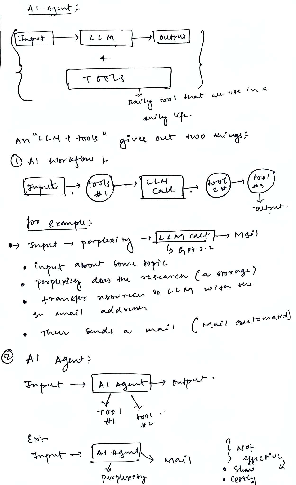
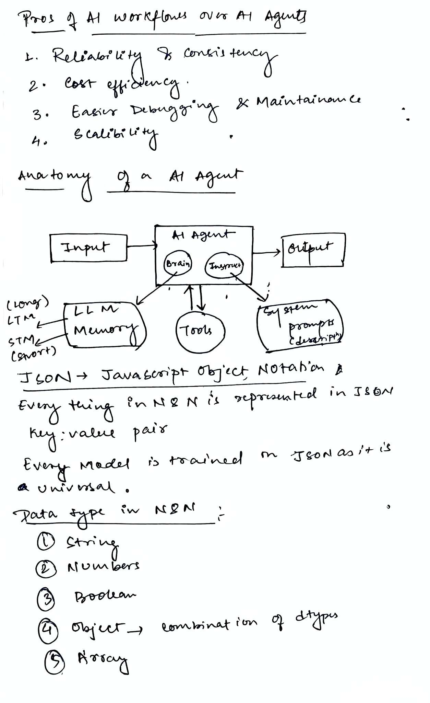
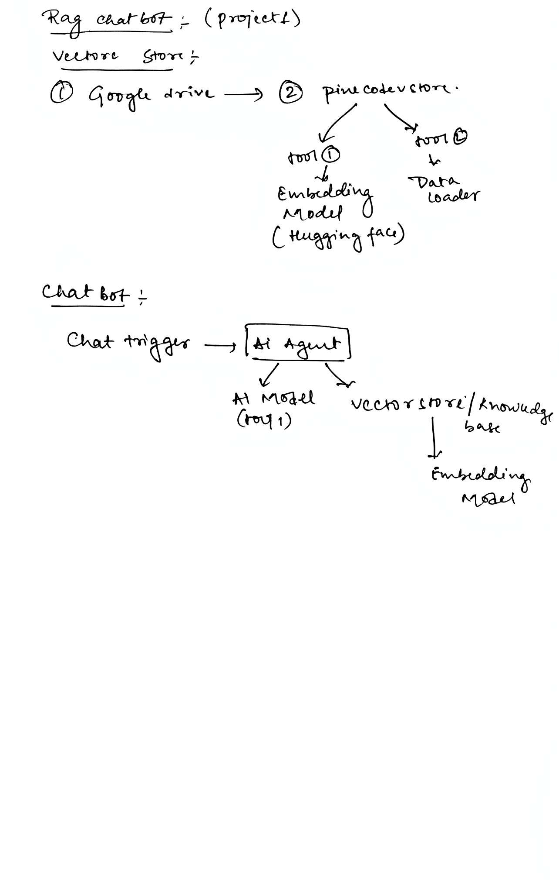
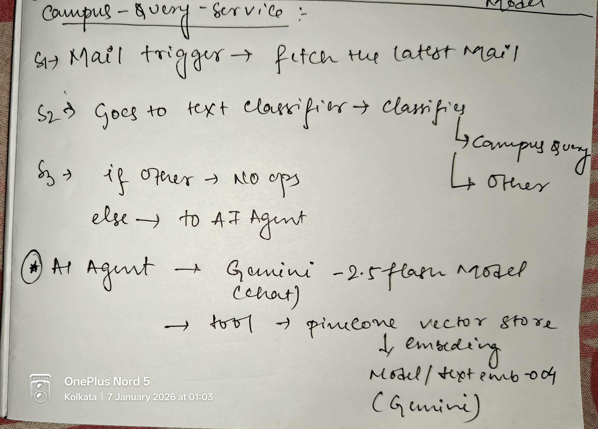
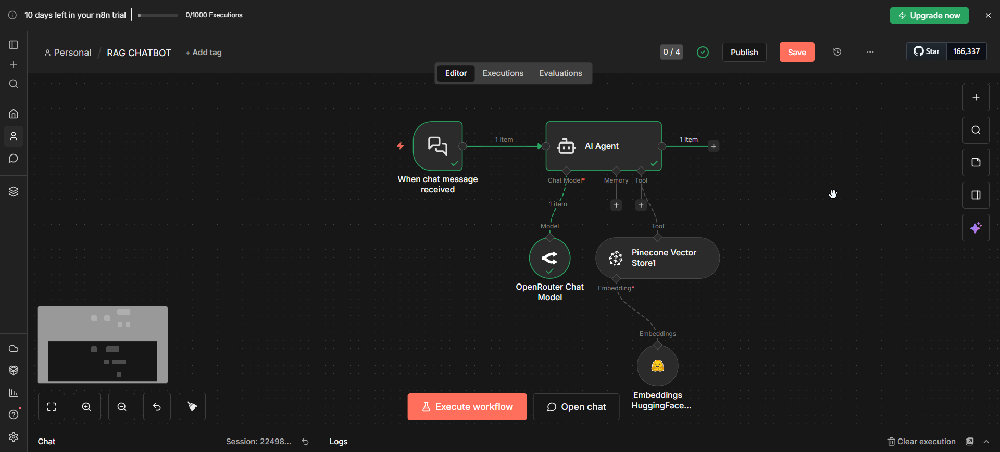
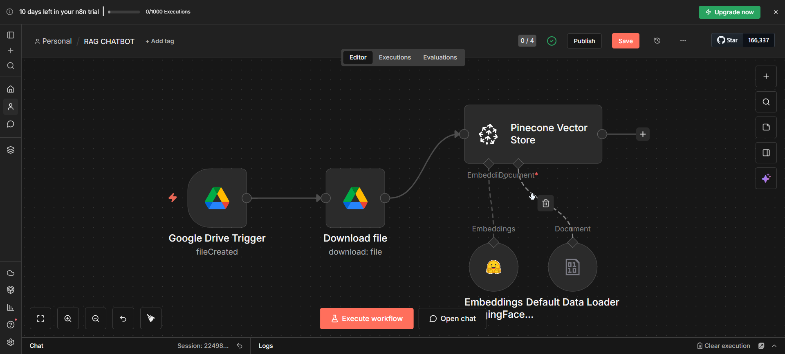

# N8N Learning Journey 🚀

Welcome to my n8n learning repository! This is a comprehensive collection of my exploration into **n8n workflow automation** and **AI Agents**, documenting my journey from beginner to building production-ready AI-powered workflows.

## 📚 What is This Repository?

This repository serves as my personal learning hub where I:
- 🎯 Explore n8n's powerful workflow automation capabilities
- 🤖 Learn about AI Agents and their integration patterns
- 🔨 Build practical, real-world automation workflows
- 📖 Document key concepts and learnings
- 💡 Experiment with different AI services and tools

## 🗂️ Repository Structure

```
N8N-Learning/
├── Workflows/          # Working n8n workflow exports (.json)
├── Docs/              # Learning documentation and guides
├── Examples/          # Screenshots and visual references
└── README.md          # You are here!
```

## 🎓 Learning Focus Areas

### 1. n8n Fundamentals
- Understanding workflow automation concepts
- Node connections and data flow
- Triggers and scheduled executions
- Error handling and monitoring

### 2. AI Agent Development
Understanding how AI Agents work in n8n ecosystem:
- **What are AI Agents?** Autonomous systems that can reason, plan, and execute tasks
- **Agent Components**: Language models, tools, memory, and retrieval systems
- **Use Cases**: Chatbots, automation assistants, and intelligent workflows

### 3. Integration Patterns
Connecting various services and APIs:
- Google Drive & Gmail automation
- Vector databases (Pinecone)
- AI/ML services (Google Gemini, HuggingFace, OpenRouter)
- Webhooks and real-time triggers
- Text classification and intelligent routing

---

## 🛠️ Projects & Workflows

### 1️⃣ Campus Query Replier - AI Customer Support Automation 📧✨

**Latest Project!** An intelligent email automation system that classifies incoming campus queries and generates context-aware responses using AI.

#### 🎯 What It Does
Automatically monitors Gmail inbox, classifies emails, and generates helpful responses for campus-related queries using RAG architecture.

#### ✨ Key Features
- ✅ **Gmail Integration** - Monitors inbox every minute for new emails
- ✅ **Text Classification** - AI-powered categorization (Campus query vs Other)
- ✅ **Intelligent Routing** - Only processes relevant campus emails
- ✅ **RAG-Powered Responses** - Uses knowledge base for accurate answers
- ✅ **Friendly AI Agent** - Responds with emojis and helpful tone
- ✅ **Custom Namespace** - Organized vector storage (`rag_docs`)

#### 🏗️ Architecture
```
Gmail Trigger → Text Classifier → AI Agent → Auto-Response
                       ↓                ↓
              (Campus Query)    Pinecone Retrieval
                       ↓                ↓
              (Other emails)    Google Gemini LLM
                       ↓
              (No Action)
```

#### 🔧 Technologies Used
| Component | Technology | Purpose |
|-----------|-----------|---------|
| **Trigger** | Gmail Trigger | Monitors inbox every minute |
| **Classification** | LangChain Text Classifier | Categorizes emails |
| **LLM** | Google Gemini | Powers classification & responses |
| **Vector DB** | Pinecone (rag-index-768) | Stores knowledge base |
| **Embeddings** | Google Gemini Embeddings | Converts text to vectors |
| **AI Agent** | n8n AI Agent | Orchestrates response generation |

#### 💡 What I Learned
- Email automation with Gmail API
- Text classification for intelligent routing
- Conditional workflows based on AI decisions
- Custom system prompts for tone and style
- Namespace organization in Pinecone

---

### 2️⃣ RAG Chatbot - Interactive Document Q&A 💬🤖

**Updated Version!** A production-ready RAG chatbot with automated document ingestion from Google Drive and intelligent question-answering.

#### 🎯 What It Does
Automatically indexes documents from Google Drive into a vector database and provides accurate, context-aware responses to user queries.

#### ✨ Key Features
- ✅ **Automated Document Ingestion** from Google Drive
- ✅ **Real-time monitoring** of FAQ folder for new files
- ✅ **Google Gemini Embeddings** for high-quality vector representations
- ✅ **Pinecone Vector Storage** for efficient semantic search
- ✅ **Interactive Chat Interface** with webhook triggers
- ✅ **Context-Aware Answers** grounded in actual documents

#### 🏗️ Architecture

**Document Ingestion Pipeline:**
```
Google Drive Trigger → Download File → Default Data Loader
                                              ↓
                              Google Gemini Embeddings
                                              ↓
                              Pinecone Vector Store (rag_docs)
```

**Chat Query Pipeline:**
```
Chat Trigger → AI Agent → Pinecone Retrieval Tool
                    ↓
          Google Gemini Chat Model
```

#### 🔧 Technologies Used
| Component | Technology | Purpose |
|-----------|-----------|---------|
| **Trigger** | Google Drive Trigger | Monitors FAQ folder |
| **File Handler** | Google Drive Download | Retrieves documents |
| **Data Loader** | Default Data Loader | Processes binary files |
| **Embeddings** | Google Gemini | Text → Vectors |
| **Vector DB** | Pinecone (rag-index-768) | Semantic search |
| **LLM** | Google Gemini Chat Model | Response generation |
| **Chat Interface** | Chat Trigger | Webhook-based UI |

#### 🆕 Recent Updates
- **Upgraded from HuggingFace to Google Gemini Embeddings** - Better quality and performance
- **Updated Pinecone index** to `rag-index-768` for optimal embedding dimensions
- **Improved namespace organization** using `rag_docs`
- **Streamlined architecture** with Google-native embedding solution

#### 💡 What I Learned
- Building complete RAG pipelines from scratch
- Document ingestion automation
- Vector database operations and namespaces
- Webhook-based chat interfaces
- Upgrading embedding models for better performance

---

## 📖 Documentation & Resources

### My Learning Docs
Located in the `Docs/` folder - here's what I've been studying:

#### AI Agent Architecture & Concepts

*Understanding AI Agent fundamentals and architecture*


*Advanced AI Agent concepts and implementation patterns*

#### Project Planning

*Initial planning and architecture for the RAG chatbot project*


*Planning for the Campus Query Replier automation workflow*

### Example Screenshots
Visual demonstrations of the workflows in action:

#### Chatbot Interface

*Interactive chat interface powered by the RAG system*

#### Vector Store Configuration

*Pinecone vector store configuration and embedding setup*

---

## 🎯 Skills Developed

Through this learning journey, I've gained hands-on experience with:

| Skill | Description |
|-------|-------------|
| **Workflow Design** | Creating efficient, maintainable automation flows |
| **API Integration** | Connecting multiple services seamlessly (Gmail, Google Drive, Pinecone) |
| **Vector Databases** | Understanding embeddings and semantic search |
| **RAG Architecture** | Building context-aware AI systems |
| **AI Orchestration** | Managing LLM interactions and tool usage |
| **Text Classification** | Intelligent email routing and categorization |
| **Conditional Logic** | Building smart workflows with decision trees |
| **Email Automation** | Gmail integration for customer support |
| **Error Handling** | Implementing robust error management |

---

## 🚀 What's Next?

As I continue my n8n learning journey, I plan to explore:

- [ ] Multi-agent systems with specialized roles
- [ ] Advanced memory systems for conversational context
- [ ] Custom tool creation for specialized tasks
- [ ] Integration with more data sources (Slack, Discord, Notion)
- [ ] Advanced chunking strategies for better retrieval
- [ ] Production deployment and monitoring
- [ ] Cost optimization for AI API usage
- [ ] Automated email responses with A/B testing
- [ ] Multi-language support for global workflows

---

## 💡 Key Learnings

### About n8n
- **Visual Programming**: n8n's node-based interface makes complex workflows intuitive
- **Flexibility**: Easy to connect different services without writing extensive code
- **AI-Native**: Built-in support for modern AI/ML services and patterns
- **Conditional Workflows**: Smart routing based on AI decisions

### About AI Agents
- **RAG is Powerful**: Combining retrieval with generation prevents hallucinations
- **Embeddings Matter**: Quality embeddings are crucial for semantic search accuracy
- **Tool Usage**: AI agents become much more capable when given access to tools
- **Text Classification**: Essential for intelligent automation and routing

### Best Practices
- Start simple and iterate
- Test with small datasets first
- Use namespaces to organize vector data
- Monitor API usage and costs
- Document your workflows thoroughly
- Version control your workflow JSON files
- Choose the right embedding model for your use case
- System prompts are crucial for agent behavior

---

## 🔧 Tools & Services Used

- **n8n** - Workflow automation platform
- **Google Drive** - Document storage and monitoring
- **Gmail** - Email automation and triggers
- **Pinecone** - Vector database (rag-index-768)
- **Google Gemini** - Embeddings and LLM
- **HuggingFace** - Alternative embeddings (learning)
- **OpenRouter** - LLM access (Mistral-7B)
- **LangChain** - Text classification and AI tools

---

## 📝 Progress Tracker

### Completed ✅
- [x] Basic n8n workflow concepts
- [x] Google Drive integration and triggers
- [x] Gmail automation
- [x] RAG architecture implementation
- [x] Vector database integration (Pinecone)
- [x] Text classification workflows
- [x] AI agent orchestration
- [x] Embedding model upgrades
- [x] Namespace organization

### In Progress 🔄
- [ ] Advanced agent workflows
- [ ] Production deployment strategies
- [ ] Performance optimization

### Planned 📅
- [ ] Multi-agent systems
- [ ] Slack/Discord integrations
- [ ] Custom tools development

---

## 🤝 About This Journey

I'm documenting this learning process to:
- Track my progress in workflow automation
- Build a reference for future projects
- Share knowledge with others learning n8n
- Develop practical AI automation skills
- Experiment with cutting-edge AI technologies

---

**Status**: 🟢 Actively Learning | **Focus**: AI Agents, Email Automation & RAG Workflows | **Projects**: 2 Workflows Built

*Feel free to explore the workflows and documentation. This repository will grow as my n8n expertise develops!*

---

## 🔗 Quick Links

- [n8n Documentation](https://docs.n8n.io/)
- [LangChain Docs](https://docs.langchain.com/)
- [Pinecone Documentation](https://docs.pinecone.io/)
- [Google Gemini API](https://ai.google.dev/)

---

**Last Updated**: January 2026 📅
